# MuleSoft Agent Fabric Compendium

**Document Version:** 1.1
**Last Updated:** December 14, 2025

## Table of Contents

1. [Executive Summary](#1-executive-summary)
2. [The Problem - AI Agent Fragmentation](#2-the-problem---ai-agent-fragmentation)
   - 2.1 [Origins of Fragmentation](#21-origins-of-fragmentation)
   - 2.2 [The "Silo" Effect and Enterprise Blindness](#22-the-silo-effect-and-enterprise-blindness)
   - 2.3 [Operational and Compliance Risks](#23-operational-and-compliance-risks)
   - 2.4 [The "Black Box" Problem](#24-the-black-box-problem)
3. [Discover Pillar - Enterprise Agent Registry](#3-discover-pillar---enterprise-agent-registry)
   - 3.1 [Agent Registry Architecture](#31-agent-registry-architecture)
   - 3.2 [Supported Asset Types](#32-supported-asset-types)
   - 3.3 [Metadata Abstraction Pattern](#33-metadata-abstraction-pattern)
   - 3.4 [Publishing and Discovering Assets](#34-publishing-and-discovering-assets)
   - 3.5 [MuleSoft Vibes - AI-Assisted Discovery](#35-mulesoft-vibes---ai-assisted-discovery)
   - 3.6 [Licensing and Constraints](#36-licensing-and-constraints)
4. [Orchestrate Pillar - Agent Broker](#4-orchestrate-pillar---agent-broker)
   - 4.1 [Agent Broker Architecture](#41-agent-broker-architecture)
   - 4.2 [The Dual-Protocol Approach](#42-the-dual-protocol-approach-a2a-vs-mcp)
   - 4.3 [LLM-Powered Reasoning and Task Decomposition](#43-llm-powered-reasoning-and-task-decomposition)
   - 4.4 [YAML-Based Configuration](#44-yaml-based-configuration)
   - 4.5 [Human-in-the-Loop Patterns](#45-human-in-the-loop-patterns)
   - 4.6 [Infrastructure Requirements](#46-infrastructure-requirements)
   - 4.7 [Operational Flow and Deployment](#47-operational-flow-and-deployment)
5. [Govern Pillar - Security and Compliance](#5-govern-pillar---security-and-compliance)
   - 5.1 [Flex Gateway as Enforcement Point](#51-flex-gateway-as-enforcement-point)
   - 5.2 [Policy Types](#52-policy-types)
   - 5.3 [Ingress and Egress Control Architecture](#53-ingress-and-egress-control-architecture)
   - 5.4 [Behavioral Guardrails via YAML Instructions](#54-behavioral-guardrails-via-yaml-instructions)
   - 5.5 [Zero Trust Principles](#55-zero-trust-principles)
   - 5.6 [Policy Enforcement Workflow](#56-policy-enforcement-workflow)
6. [Observe Pillar - Agent Visualizer](#6-observe-pillar---agent-visualizer)
   - 6.1 [Agent Visualizer Components](#61-agent-visualizer-components)
   - 6.2 [Performance Monitoring Metrics](#62-performance-monitoring-metrics)
   - 6.3 [End-to-End Tracing and Debugging](#63-end-to-end-tracing-and-debugging)
   - 6.4 [Compliance Auditing for Non-Deterministic Systems](#64-compliance-auditing-for-non-deterministic-systems)
   - 6.5 [Log Integration and Root Cause Analysis](#65-log-integration-and-root-cause-analysis)
7. [Technical Architecture Reference](#7-technical-architecture-reference)
   - 7.1 [Architecture Layers](#71-architecture-layers)
   - 7.2 [Component Interaction Model](#72-component-interaction-model)
   - 7.3 [Protocol Specifications](#73-protocol-specifications-mcp-and-a2a)
   - 7.4 [Development Lifecycle](#74-development-lifecycle)
8. [Insight Tables](#8-insight-tables)
   - 8.1 [Feature Comparison Table](#81-feature-comparison-table)
   - 8.2 [Policy Types Summary Table](#82-policy-types-summary-table)
   - 8.3 [Asset Types and Lifecycle States Table](#83-asset-types-and-lifecycle-states-table)
   - 8.4 [Infrastructure Requirements Matrix](#84-infrastructure-requirements-matrix)
   - 8.5 [LLM Support Matrix](#85-llm-support-matrix)
9. [Contrasts and Alignments](#9-contrasts-and-alignments)
   - 9.1 [Convergence Points Across Sources](#91-convergence-points-across-sources)
   - 9.2 [Terminology Variations and Standardization](#92-terminology-variations-and-standardization)
   - 9.3 [Feature Depth by Source](#93-feature-depth-by-source)
   - 9.4 [Roadmap Items vs Current Capabilities](#94-roadmap-items-vs-current-capabilities)
10. [Final Takeaways](#10-final-takeaways)
    - 10.1 [Strategic Recommendations](#101-strategic-recommendations)
    - 10.2 [Implementation Priorities](#102-implementation-priorities)
    - 10.3 [Common Pitfalls to Avoid](#103-common-pitfalls-to-avoid)
11. [Appendix A - For Architects](#11-appendix-a---for-architects)
    - A.1 [Protocol Specifications](#a1-protocol-specifications)
    - A.2 [Integration Patterns](#a2-integration-patterns)
    - A.3 [Security Architecture](#a3-security-architecture)
    - A.4 [Performance Considerations](#a4-performance-considerations)
    - A.5 [Infrastructure Checklist](#a5-infrastructure-checklist)
12. [Appendix B - For Presales Personnel](#12-appendix-b---for-presales-personnel)
    - B.1 [Business Value Propositions by Pillar](#b1-business-value-propositions-by-pillar)
    - B.2 [Use Case Library](#b2-use-case-library)
    - B.3 [ROI Indicators](#b3-roi-indicators)
    - B.4 [Competitive Positioning](#b4-competitive-positioning)
    - B.5 [Customer-Facing Messaging Templates](#b5-customer-facing-messaging-templates)
13. [Reference Materials](#13-reference-materials)
    - 13.1 [Bibliography](#131-bibliography)
    - 13.2 [Source Cross-Reference Table](#132-source-cross-reference-table)
    - 13.3 [Glossary with Source Attribution](#133-glossary-with-source-attribution)

---

## 1. Executive Summary

MuleSoft Agent Fabric is an enterprise-grade agent management platform designed to maximize the potential of every AI agent, regardless of where it's built [[SRC-DOCS]](#src-docs). It addresses the critical challenge of "agent sprawl"—the fragmentation caused by disconnected AI agents across different teams, vendors, and platforms [[SRC-INTRO](#src-intro), [SRC-DOCS](#src-docs)].

As organizations deploy agents embedded in SaaS platforms, built in-house, or packaged with LLMs, they face "siloed" agents that cannot orchestrate actions across domains or adhere to security guardrails [[SRC-DISCOVER](#src-discover)]. Agent Fabric transforms these uncontrolled agents into a **governed, coordinated, and intelligent network** [[SRC-INTRO](#src-intro), [SRC-DISCOVER](#src-discover), [SRC-GOVERN](#src-govern), [SRC-OBSERVE](#src-observe), [SRC-ORCHESTRATE](#src-orchestrate)].

### The Four Pillars at a Glance

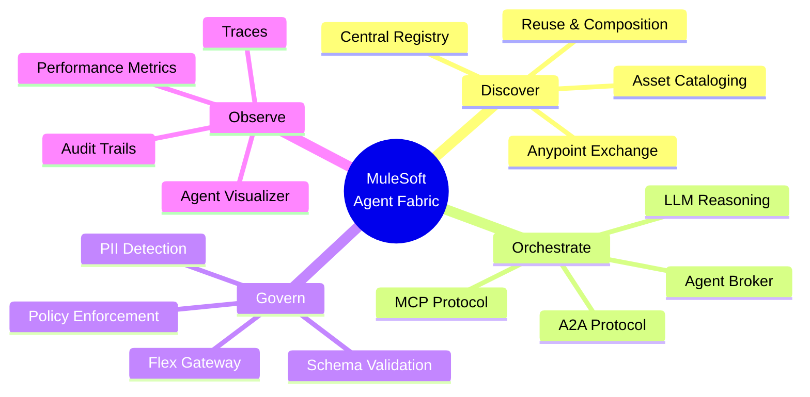

**Key Value Propositions:**

| Benefit | Description | Source |
|---------|-------------|--------|
| **Simplified Development** | Define agent processes using human-readable YAML rather than complex code | [[SRC-DOCS]](#src-docs) |
| **Safety and Governance** | Enterprise-grade guardrails ensuring control and compliance | [[SRC-GOVERN](#src-govern), [SRC-DOCS](#src-docs)] |
| **Observability** | Visual traces of agent decision-making processes | [[SRC-OBSERVE](#src-observe), [SRC-DOCS](#src-docs)] |
| **Flexibility** | Coordinate any type of agent regardless of origin platform | [[SRC-DOCS]](#src-docs) |
| **Tool & Agent Invocation** | Manage both deterministic and probabilistic actions | [[SRC-ORCHESTRATE](#src-orchestrate), [SRC-DOCS](#src-docs)] |

Agent Fabric acts as an "air traffic controller" for the enterprise, providing a centralized backbone to discover, orchestrate, govern, and observe AI agents [[SRC-DOCS]](#src-docs). It leverages open standards including the **Model Context Protocol (MCP)** and **Agent2Agent (A2A)** protocols [[SRC-ORCHESTRATE](#src-orchestrate), [SRC-DOCS](#src-docs)].

---

## 2. The Problem - AI Agent Fragmentation

### 2.1 Origins of Fragmentation

AI Agent Fragmentation is described as a "modern" acceleration of the historical application sprawl problem. Just as organizations previously struggled to manage nearly 900 different applications spanning their business, they now face a similar explosion of AI agents [[SRC-INTRO](#src-intro)].

Siloed agents emerge from three primary sources within the enterprise ecosystem [[SRC-DISCOVER](#src-discover)]:

| Vector | Description | Example |
|--------|-------------|---------|
| **Embedded SaaS Agents** | Agents included natively within Software-as-a-Service platforms | Salesforce, Workday, Zendesk |
| **In-House Builds** | Custom agents developed by internal teams using various tech stacks | Python, LangChain workflows |
| **LLM Packaging** | Agents packaged alongside popular Large Language Models | Anthropic, OpenAI assistants |

### 2.2 The "Silo" Effect and Enterprise Blindness

Agents operating in fragmented environments are restricted to their native contexts [[SRC-OBSERVE](#src-observe)]:

- **Contextual Blindness:** The agent operates efficiently within its own application but remains unaware of the broader enterprise context [[SRC-DISCOVER](#src-discover)]
- **Resource Isolation:** These agents cannot locate other tools, resources, or agents required to complete complex workflows [[SRC-DISCOVER]](#src-discover)
- **Orchestration Failure:** They are unable to coordinate actions across different ecosystems, limiting them to single-domain tasks [[SRC-DISCOVER](#src-discover), [SRC-OBSERVE](#src-observe)]

> "An agent typically promises to streamline tasks within its own application but is 'blind' to the rest of the organization." [[SRC-INTRO](#src-intro)]

### 2.3 Operational and Compliance Risks

The existence of siloed agents introduces critical constraints and risks [[SRC-DISCOVER](#src-discover)]:

| Impact Category | Description | Source |
|-----------------|-------------|--------|
| **Security & Compliance** | Lack of centralized control exposes the organization to security and compliance risks with no consistent guardrails | [[SRC-DISCOVER](#src-discover), [SRC-GOVERN](#src-govern)] |
| **Operational Efficiency** | Limited insight into how agents operate prevents process improvements | [[SRC-OBSERVE]](#src-observe) |
| **Data Integrity** | Disconnected agents lead to "trapped value," preventing multi-step cross-domain processes | [[SRC-DISCOVER]](#src-discover) |
| **User Experience** | Agents cannot access resources outside their silo, creating inconsistent experiences | [[SRC-INTRO]](#src-intro) |

### 2.4 The "Black Box" Problem

A critical aspect of fragmentation is the lack of observability [[SRC-OBSERVE](#src-observe)]:

- **Opacity:** IT teams do not know how agents are functioning, making decisions, or interacting with other systems [[SRC-OBSERVE]](#src-observe)
- **Optimization Barriers:** Without visibility into "dark" workflows, teams cannot fine-tune agents or optimize inefficient processes [[SRC-OBSERVE]](#src-observe)
- **Hallucination Risks:** Opacity leads to undetected bottlenecks and "hallucination errors" where agents generate inaccurate outputs without detection [[SRC-OBSERVE](#src-observe), [SRC-DOCS](#src-docs)]
- **Compliance Gaps:** Because agentic systems are non-deterministic, fragmentation makes it nearly impossible to audit *why* an agent took a specific action [[SRC-OBSERVE]](#src-observe)

---

## 3. Discover Pillar - Enterprise Agent Registry

### 3.1 Agent Registry Architecture

The "Discover" capability addresses the "unmanageable explosion" of disconnected AI agents by extending **Anypoint Exchange** into a centralized enterprise agent registry [[SRC-DISCOVER](#src-discover)]. It is not a new standalone product but an evolution of the existing platform [[SRC-DISCOVER](#src-discover)].

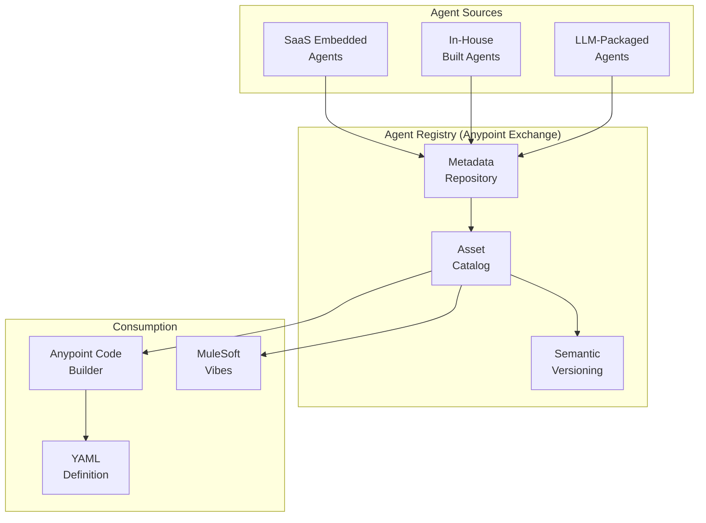

**Key Architecture Characteristics [[SRC-DISCOVER](#src-discover), [SRC-DOCS](#src-docs)]:**

- **Platform Agnostic:** The registry is designed to be neutral regarding the build platform—supports MuleSoft, Salesforce Agentforce, external tech stacks, or third-party SaaS products
- **Unified Enterprise Catalog:** Centralizes cataloging of AI assets regardless of their origin
- **Leverages Existing Infrastructure:** Uses the same infrastructure that has served thousands of customers for API management

### 3.2 Supported Asset Types

To support the "agentic" enterprise, the registry supports three specific new asset types alongside traditional APIs [[SRC-DISCOVER](#src-discover)], [[SRC-DOCS]](#src-docs):

| Asset Type | Description | Metadata Requirements |
|------------|-------------|----------------------|
| **A2A Agents** | Autonomous agents designed for Agent-to-Agent interaction | Method (A2A card), Platform (MuleSoft/Agentforce/Other) |
| **MCP Servers** | Implementations of the Model Context Protocol providing standardized context to LLMs | MCP schema upload, Platform selection |
| **LLMs** | Large Language Models (e.g., OpenAI, custom models) | Provider, Lifecycle state (Stable/Development) |
| **Traditional Assets** | APIs, RAML fragments, reusable data types | Standard API metadata |

### 3.3 Metadata Abstraction Pattern

The registry operates on a metadata level. If an agent is built outside of MuleSoft (e.g., a Python service or a LangChain workflow), its **metadata** is published to the registry [[SRC-DISCOVER](#src-discover)]. This ensures:

- Implementation logic remains where it is best suited
- The asset remains discoverable and reusable across the enterprise
- Teams do not need to migrate code to MuleSoft—simply publish the metadata and schema [[SRC-DISCOVER]](#src-discover)

**Deterministic vs Non-Deterministic Convergence [[SRC-DISCOVER](#src-discover)]:**

| Type | Characteristics | Examples |
|------|-----------------|----------|
| **Deterministic** | Structured, rigid processes requiring specific fields | API transactions like "Checkout" requiring address and credit card |
| **Non-Deterministic** | Dynamic reasoning to accomplish tasks based on available tools | LLMs figuring out how to complete a task |

The registry supports both, enabling architects to build systems where dynamic agents complement structured APIs [[SRC-DISCOVER]](#src-discover).

### 3.4 Publishing and Discovering Assets

#### Workflow: Publishing an Agent Asset [[SRC-DISCOVER](#src-discover)]

1. Navigate to **Anypoint Exchange**
2. Click **"Publish new asset"**
3. Select the specific **Asset Type**: LLM, MCP Server, or Agent
4. Configure the asset metadata:
   - **For Agents:** Select method (A2A card), Platform (MuleSoft, Agentforce, Other)
     - **A2A Agent Card requirement:** The uploaded Agent Card must include the root `url` field (service endpoint). If missing, Exchange validation fails (e.g., `required key [url] not found`).
   - **For LLMs:** Select provider (e.g., OpenAI), Lifecycle State (Stable/Development)
   - **For MCP Servers:** Upload MCP schema, select platform
5. Click **"Publish"** to make the asset discoverable

#### Workflow: Consuming Assets in Anypoint Code Builder [[SRC-DISCOVER](#src-discover)]

1. Open **Anypoint Code Builder**
2. Start a new **Agent Network Project**
3. **Discovery Phase:**
   - *Option A (AI-Assisted):* Use **MuleSoft Vibes** to prompt the system (e.g., "Find MCP servers for shipping")
   - *Option B (Manual):* Input the specific Asset Identifier and Version
4. **Definition Phase:** Selected assets are defined in the project's YAML configuration file

> **Note:** There is no drag-and-drop interface for browsing Exchange and placing agent assets into the canvas. Configuration must be done via YAML or Vibes prompts [[SRC-DISCOVER]](#src-discover).

### 3.5 MuleSoft Vibes - AI-Assisted Discovery

**MuleSoft Vibes** is an AI capability within Anypoint Code Builder that allows developers to use natural language to discover assets in Exchange [[SRC-DISCOVER](#src-discover)]:

- Enables prompts like "Find MCP servers for shipping" to locate assets
- Generates necessary configuration based on discovered assets
- Reduces the learning curve for developers new to Agent Fabric [[SRC-DOCS]](#src-docs)

### 3.6 Licensing and Constraints

**Licensing [[SRC-DISCOVER](#src-discover)]:**
- The Agent Registry (Discovery) is **included in the base MuleSoft subscription**
- Teams can begin cataloging agents immediately without additional procurement
- Other components (Orchestration, Governance, Observation) may require specific licenses [[SRC-INTRO](#src-intro), [SRC-DOCS](#src-docs)]

**Current Limitations [[SRC-DISCOVER](#src-discover)]:**

| Constraint | Description | Status |
|------------|-------------|--------|
| **Manual Synchronization** | Syncing agents between external registries and Agent Fabric is manual | Automated aggregation on roadmap |
| **No Drag-and-Drop** | Agent Network projects do not support visual drag-and-drop from Exchange | By design—YAML-based |
| **Closed Discovery** | Registry does not automatically scan enterprise network for unregistered assets | Assets must be explicitly registered |
| **No Agent API Templates** | Limited templates available at launch | Some example MCP servers provided |

---

## 4. Orchestrate Pillar - Agent Broker

### 4.1 Agent Broker Architecture

The **Agent Broker** is the core orchestration engine within MuleSoft Agent Fabric. It functions as a context-aware routing service that transforms isolated AI agents and deterministic tools into a coordinated network [[SRC-ORCHESTRATE](#src-orchestrate)].

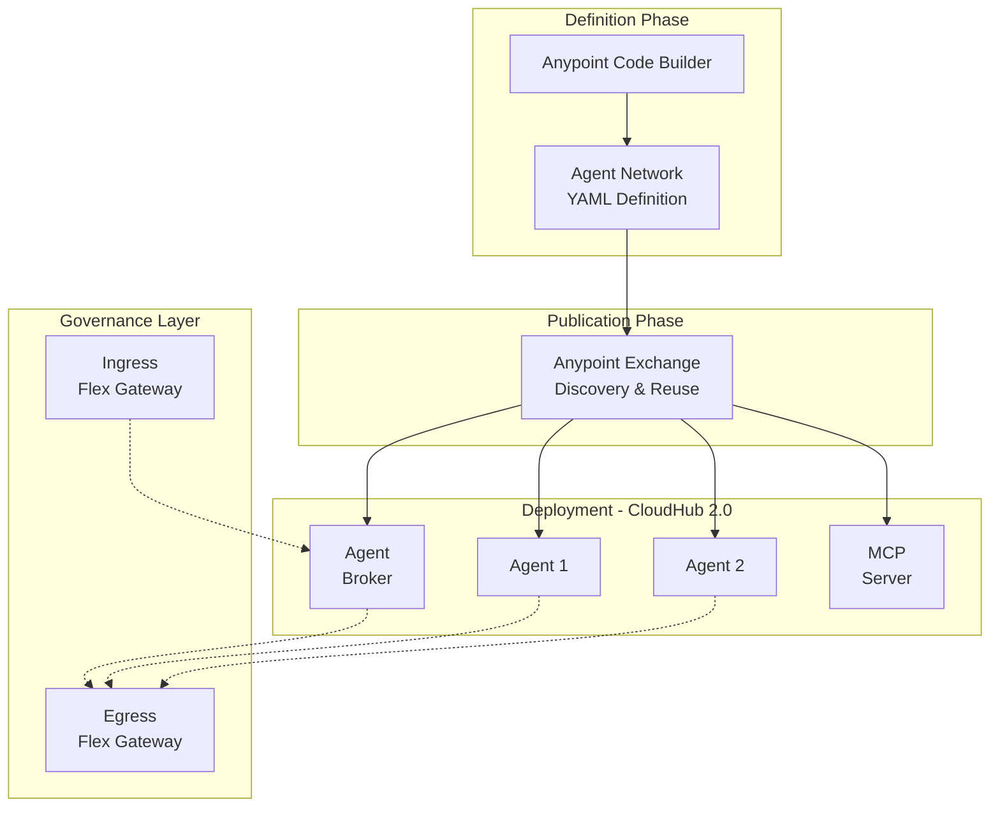

**Key Characteristics [[SRC-ORCHESTRATE](#src-orchestrate), [SRC-DOCS](#src-docs)]:**

- **Context-Aware Routing:** Routes based on request intent, policies, user identity, and runtime state
- **LLM-Powered Reasoning:** Uses Large Language Models for planning and decision-making
- **Task Decomposition:** Breaks complex processes into discrete steps handled by specialized agents
- **Reusability:** Brokers are themselves specialized agents that can be reused by other brokers
- **Dynamic Discovery:** Continuously discovers and engages the best-fit agents and assets

### 4.2 The Dual-Protocol Approach (A2A vs MCP)

The Agent Broker leverages two distinct AI protocols to communicate with both "thinking" agents and deterministic tools [[SRC-ORCHESTRATE](#src-orchestrate)]:

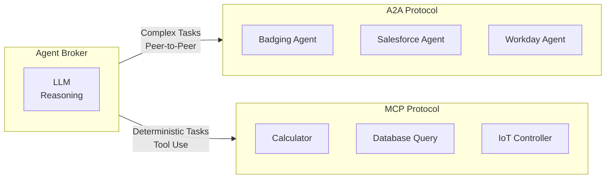

| Feature | A2A (Agent-to-Agent) | MCP (Model Context Protocol) |
|---------|----------------------|------------------------------|
| **Primary Role** | Delegation to a Peer | Execution of a Tool |
| **Intelligence** | "Thinker" (Has its own LLM/Reasoning) | "Doer" (Standard computer program) |
| **Interaction Modes** | Sync request/response, Streaming (SSE), Async push notifications | Input/Output (Function Call) |
| **Protocol Base** | JSON-RPC 2.0 over HTTP(S) | Tool Use Standard |
| **Discovery** | Agent Cards at `/.well-known/agent-card.json` | Tool definitions in configuration |
| **Example** | Requesting a "Badging Agent" to generate a badge | Using a "Calculator" to multiply numbers |
| **Origin** | Google → Linux Foundation (Open Standard) | Anthropic (Open Standard) |

**Source:** [[SRC-ORCHESTRATE](#src-orchestrate)]

### 4.3 LLM-Powered Reasoning and Task Decomposition

The Broker uses its configured LLM to analyze natural language queries and intelligently delegate work [[SRC-ORCHESTRATE](#src-orchestrate)]:

1. **Intent Analysis:** LLM analyzes the request against configured instructions
2. **Tool Selection:** Determines whether to engage A2A agent or MCP tool
3. **Parameter Collection:** If missing information is detected, prompts user for specifics
4. **Result Synthesis:** Combines outputs from multiple agents/tools into final response

**Supported LLMs [[SRC-GOVERN](#src-govern)]:**

| Status | Provider |
|--------|----------|
| **At Launch** | OpenAI (Direct API), Azure OpenAI |
| **Roadmap** | Salesforce Einstein, Google Vertex, Amazon Bedrock, Claude |

### 4.4 YAML-Based Configuration

Agent Network Projects are defined using **YAML-based definition files** rather than traditional Mule flow XML [[SRC-ORCHESTRATE](#src-orchestrate)], [[SRC-DOCS]](#src-docs):

```yaml
# Example Agent Network Configuration Structure
broker:
  name: "Employee Onboarding Broker"
  llm: 
    provider: "openai"
    model: "gpt-4o-mini"
  instructions: |
    Calculating arithmetic should never be done by agents; 
    always use the calculator tool.
  agents:
    - name: "Badging Agent"
      protocol: "a2a"
      endpoint: "https://..."
    - name: "Workday Agent"
      protocol: "a2a"
  tools:
    - name: "Calculator"
      protocol: "mcp"
```

**Key Configuration Elements [[SRC-ORCHESTRATE](#src-orchestrate), [SRC-DOCS](#src-docs)]:**

- **LLM Provider:** GPT-4o Mini, Azure OpenAI, etc.
- **Agents:** External agents defined using A2A
- **Tools:** MCP servers for deterministic execution
- **Instructions:** Plain English instructions guiding routing decisions

### 4.5 Human-in-the-Loop Patterns

The Broker supports **Multi-turn** interactions and **Human-in-the-Loop (HITL)** patterns [[SRC-INTRO](#src-intro)]:

- **Scenario:** Broker determines it lacks specific information (e.g., sales territory assignment)
- **Action:** Pauses automated flow and requests missing information via chat interface
- **Resumption:** Once user responds, Broker continues orchestration steps

> "The Agent Broker pauses to ask the user via Slack for a specific territory assignment. Upon receiving the input, the Broker proceeds to provision IT assets and request a badge." [[SRC-INTRO](#src-intro)]

### 4.6 Infrastructure Requirements

**Mandatory Infrastructure [[SRC-ORCHESTRATE](#src-orchestrate)]:**

| Component | Requirement | Notes |
|-----------|-------------|-------|
| **Runtime Environment** | Private Space in CloudHub 2.0 | Required for Broker deployment |
| **Gateway** | Managed Flex Gateway | Must include both Ingress and Egress |
| **Gateway Mode** | Managed mode only | Connected mode NOT supported |
| **LLM** | Bring Your Own LLM (BYO-LLM) | OpenAI/Azure OpenAI at launch |
| **IDE** | Anypoint Code Builder | Extension Pack v1.11.5+ |

### 4.7 Operational Flow and Deployment

#### Deployment Process [[SRC-ORCHESTRATE](#src-orchestrate)]

1. **Publish:** Execute `mulesoft publish agent network assets` to push artifacts to Exchange
2. **Deploy:** Execute `mulesoft deploy agent network` to deploy to Private Space
3. **Configure Gateway:** Ensure Ingress/Egress gateways are configured

#### Runtime Execution Flow [[SRC-ORCHESTRATE](#src-orchestrate)]

1. **Ingest:** User sends natural language query via HTTP (A2A protocol)
2. **Reasoning:** Broker's LLM analyzes request based on YAML instructions
3. **Routing/Delegation:**
   - *Agent Delegation:* A2A request to sub-agent (e.g., Badging Agent)
   - *Tool Use:* MCP request to tool (e.g., Calculator)
4. **Feedback Loop:** If parameters missing, Broker prompts user
5. **Response:** Broker synthesizes results and returns final answer

**Constraints [[SRC-ORCHESTRATE](#src-orchestrate)]:**

- **Static Topology:** Available agents must be pre-connected and defined in YAML; no auto-discovery at runtime
- **Node Limits:** Soft limit of ~25 nodes per network to prevent complexity and hallucination risks
- **Broker Chaining:** For larger requirements, use "brokers using other brokers" pattern

---

## 5. Govern Pillar - Security and Compliance

### 5.1 Flex Gateway as Enforcement Point

Agent Governance is implemented by extending the existing **Flex Gateway** to support AI protocols [[SRC-GOVERN](#src-govern)]:

- Extends standard API gateway capabilities to support **MCP** and **A2A** interactions
- Decouples governance from agent logic
- Enforces security, compliance, and traffic controls regardless of agent hosting location [[SRC-GOVERN](#src-govern)]

**Infrastructure Components [[SRC-GOVERN](#src-govern)]:**

| Component | Role |
|-----------|------|
| **Flex Gateway** | Primary enforcement point for agent governance |
| **CloudHub 2.0** | Hosts MCP servers and Agents |
| **API Manager** | Defines and attaches policies to gateways |
| **Mule Chain Connectors** | Builds agents that reason using LLMs |

### 5.2 Policy Types

Four specific A2A/MCP policies are available out-of-the-box [[SRC-GOVERN](#src-govern)], [[SRC-INTRO](#src-intro)]:

| Policy | Target | Purpose | Action |
|--------|--------|---------|--------|
| **Client ID Enforcement** | Agent & MCP Server | Authentication/Authorization | Ensures only authorized consumers can invoke |
| **A2A PII Detector** | Agent | Compliance | Scans prompts for SSN, Credit Cards; blocks or logs |
| **MCP Schema Validation** | MCP Server | Traffic Control | Validates requests adhere to MCP tool definition |
| **Prompt Decorator** | Agent | Context Enhancement | Injects contextual information into prompts |
| **Agent Card Policy** | Agent | Metadata Management | Rewrites Agent Card URL to gateway URL |

### 5.3 Ingress and Egress Control Architecture

Governance in Agent Fabric is bidirectional [[SRC-ORCHESTRATE](#src-orchestrate)]:

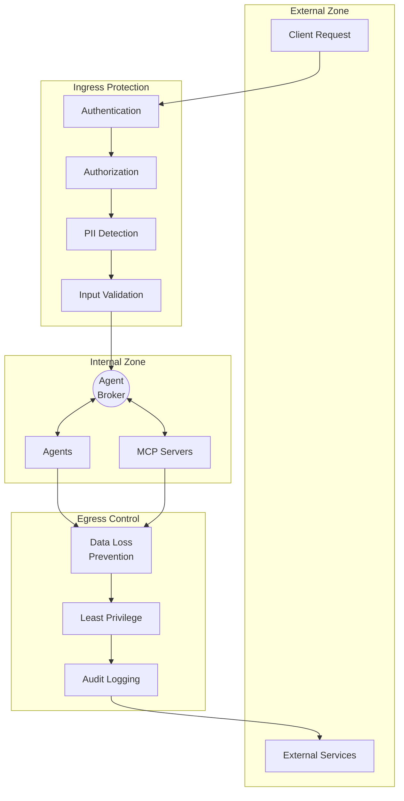

**Layered Security Approach [[SRC-GOVERN](#src-govern)]:**

| Layer | Component | Applied Policies | Role |
|-------|-----------|------------------|------|
| **Agent Layer** | Agent Cart (Mule App with LLM) | Client ID Enforcement, A2A PII Detector | Protects reasoning engine, blocks sensitive data |
| **Tooling Layer** | MCP Server (Mule App as Tools) | Client ID Enforcement, MCP Schema Validation | Protects backend systems, validates protocol |

### 5.4 Behavioral Guardrails via YAML Instructions

Beyond network-level governance, Agent Fabric enables "logic governance" via configuration [[SRC-ORCHESTRATE](#src-orchestrate)]:

- Plain English instructions in YAML act as strict guardrails for LLM reasoning
- Dictate which tools must be used for specific tasks
- Prevent hallucinations by forcing deterministic execution where appropriate

**Example:**
```yaml
instructions: |
  Calculating arithmetic should never be done by agents; 
  always use the calculator tool.
  Never process requests containing personal financial information.
```

### 5.5 Zero Trust Principles

Agent Fabric implements Zero Trust security [[SRC-DOCS]](#src-docs):

| Principle | Implementation |
|-----------|----------------|
| **Never Trust, Always Verify** | Client ID Enforcement at every layer |
| **Least Privilege** | Egress gateway ensures agents only access authorized external tools |
| **Micro-segmentation** | Separate policies for Agent and MCP Server layers |
| **Continuous Verification** | Every interaction checked by Flex Gateway |

### 5.6 Policy Enforcement Workflow

**Step-by-Step Flow [[SRC-GOVERN](#src-govern)]:**

1. **Request Initiation:** User sends prompt via client app to Agent API
2. **Gateway Check 1 (Auth):** Flex Gateway validates **Client ID Enforcement**
   - *If unauthorized:* Request stops, "not authorized" error returned
3. **Gateway Check 2 (Content):** Flex Gateway executes **A2A PII Detector**
   - *If PII detected:* Request rejected, "PII data sensitive" error
4. **Agent Processing:** Clean request sent to Agent for LLM reasoning
5. **Gateway Check 3 (Service Auth):** Agent calls MCP Server; **Client ID** validated
6. **Gateway Check 4 (Protocol):** **MCP Schema Validation** ensures format compliance
7. **Execution:** Tool executes logic and returns result

**Example - Blocking PII Injection [[SRC-GOVERN](#src-govern)]:**
> User types: "Register new employee... SSN: [Redacted]."
> A2A PII Detector policy analyzes the prompt.
> Request rejected with: "Request contains PII sensitive data of type SSN."
> Agent does not process the data.

---

## 6. Observe Pillar - Agent Visualizer

### 6.1 Agent Visualizer Components

**Agent Visualizer** provides comprehensive tools to transform non-transparent networks into actionable insights [[SRC-OBSERVE](#src-observe)]:

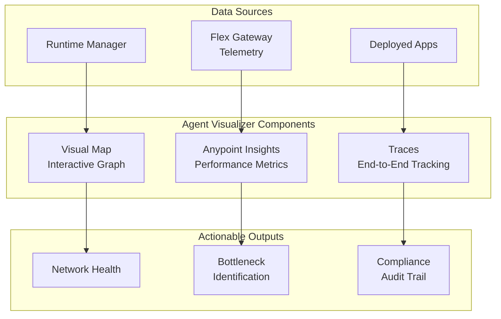

#### Component 1: The Visual Map [[SRC-OBSERVE](#src-observe)]

- **Function:** Displays an interactive graph of the agent network
- **Nodes Displayed:** Agent Broker, Agents, MCP Servers, LLMs
- **Asset Details:** Clicking a node reveals metadata, platform, LLM used, and links to Exchange documentation

#### Component 2: Anypoint Insights (Monitoring) [[SRC-OBSERVE](#src-observe)]

| Metric | Description |
|--------|-------------|
| **Request Volume** | Total requests over configurable timeframe |
| **Performance Trends** | Visual representation of load over time |
| **Response Times** | Aggregate latency data |
| **Error Rates** | Tracking of failed requests |

#### Component 3: Traces (Deep Dive) [[SRC-OBSERVE](#src-observe)]

- **Function:** Tracks specific request flow through entire service pipeline
- **Granularity:** Shows exact path (Broker → Mule Flow → Shopping Broker → Fruit Agents)
- **Performance Analysis:** Displays exact execution time for each hop
- **Log Integration:** "View Logs" button for direct root cause analysis

### 6.2 Performance Monitoring Metrics

**Key Metrics Tracked [[SRC-OBSERVE](#src-observe)]:**

| Category | Metrics | Source |
|----------|---------|--------|
| **Traffic** | Request volume, requests per second | [[SRC-OBSERVE]](#src-observe) |
| **Latency** | Response times, time per hop | [[SRC-OBSERVE]](#src-observe) |
| **Errors** | Error rates, failed requests | [[SRC-OBSERVE](#src-observe), [SRC-DOCS](#src-docs)] |
| **Performance** | Trends over configurable periods (1h, 6h, 24h) | [[SRC-OBSERVE]](#src-observe) |

### 6.3 End-to-End Tracing and Debugging

**Debugging Workflow [[SRC-OBSERVE](#src-observe)]:**

1. **Detection:** View Anypoint Insights, note request volume and response trends
2. **Investigation:** Drill down into Traces for specific request
3. **Analysis:** Review timing of each hop to identify delays
4. **Resolution:** Use "View Logs" to inspect error messages

**Trace View Features:**

- Hop-by-hop visibility showing exact request path
- Execution time displayed for each invocation
- Direct link to log management for root cause analysis

### 6.4 Compliance Auditing for Non-Deterministic Systems

**The Challenge [[SRC-OBSERVE](#src-observe)]:**

Agentic systems are **non-deterministic**—they take actions on the fly based on LLM reasoning. In regulated industries (healthcare, finance), simply seeing the result is insufficient.

**The Solution:**

- **Trace** capability provides historical proof of decision path, tool usage, and reasoning flow
- Creates auditable records of *why* an agent took a specific action
- Essential for regulatory compliance (e.g., patient prescription decisions) [[SRC-OBSERVE]](#src-observe)

> "Organizations must be able to explain *why* the agent took a specific action. The Trace capability provides the necessary historical proof." [[SRC-OBSERVE](#src-observe)]

### 6.5 Log Integration and Root Cause Analysis

**Integrated Troubleshooting Workflow [[SRC-OBSERVE](#src-observe)]:**

1. **Insights** → High-level health assessment
2. **Traces** → Bottleneck identification
3. **Logs** → Root cause analysis

**LLM Reasoning Visibility [[SRC-ORCHESTRATE](#src-orchestrate)]:**

- Logs reveal exactly which tool the LLM selected and why
- Operators can see exact input sent to a tool and output returned
- Enables auditability of the AI's decision path

**Current Limitations [[SRC-OBSERVE](#src-observe)]:**

| Limitation | Current State | Roadmap |
|------------|---------------|---------|
| **MCP Granularity** | MCP Server shown as single node | Specific tool invocations coming soon |
| **Tool-Level Visibility** | Cannot see which specific tool within MCP was called | Future enhancement |

---

## 7. Technical Architecture Reference

### 7.1 Architecture Layers

Agent Fabric architecture consists of five distinct layers [[SRC-DOCS]](#src-docs):

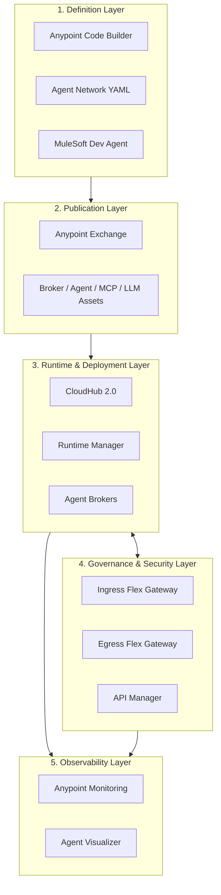

| Layer | Components | Purpose |
|-------|------------|---------|
| **Definition** | ACB, YAML, Dev Agent | Create and configure agent networks |
| **Publication** | Exchange, Assets | Discovery and reuse across enterprise |
| **Runtime** | CloudHub 2.0, Runtime Manager | Deploy and execute agentic assets |
| **Governance** | Flex Gateway, API Manager | Policy enforcement, security |
| **Observability** | Monitoring, Visualizer | Metrics, logs, traces, visual maps |

### 7.2 Component Interaction Model

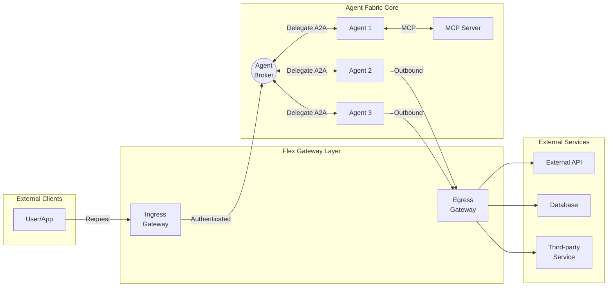

### 7.3 Protocol Specifications (MCP and A2A)

#### Model Context Protocol (MCP) [[SRC-ORCHESTRATE](#src-orchestrate)], [[SRC-DOCS]](#src-docs)

- **Purpose:** Open standard for connecting AI models to data context
- **Communication:** Functional—agent sends inputs, receives outputs
- **Use Cases:** Calculators, database queries, IoT controllers
- **Support:** Anypoint Connector for MCP, governed by Flex Gateway

#### Agent2Agent Protocol (A2A) [[SRC-ORCHESTRATE](#src-orchestrate)], [[SRC-DOCS](#src-docs)], [[SRC-A2A-OFFICIAL]](#src-a2a-official)

- **Purpose:** Open protocol (originally Google, now Linux Foundation) for peer-to-peer communication between opaque AI agents
- **Communication:** Three modes supported:
  - Synchronous request/response
  - Streaming via Server-Sent Events (SSE)
  - Asynchronous push notifications
- **Discovery:** Agent Cards (JSON) at `/.well-known/agent-card.json` (per RFC 8615)
- **Technical Implementation:** JSON-RPC 2.0 over HTTP(S)
- **Support:** Anypoint Connector for A2A, governed by Flex Gateway
- **MuleSoft A2A Connector:** Version 0.4.0-BETA (for Mule 4)
- **Ecosystem:** IBM ACP (incorporated), Cisco agntcy (leverages), Google ADK (build with)
- **A2A Protocol Version:** v0.3.0 (July 2025)

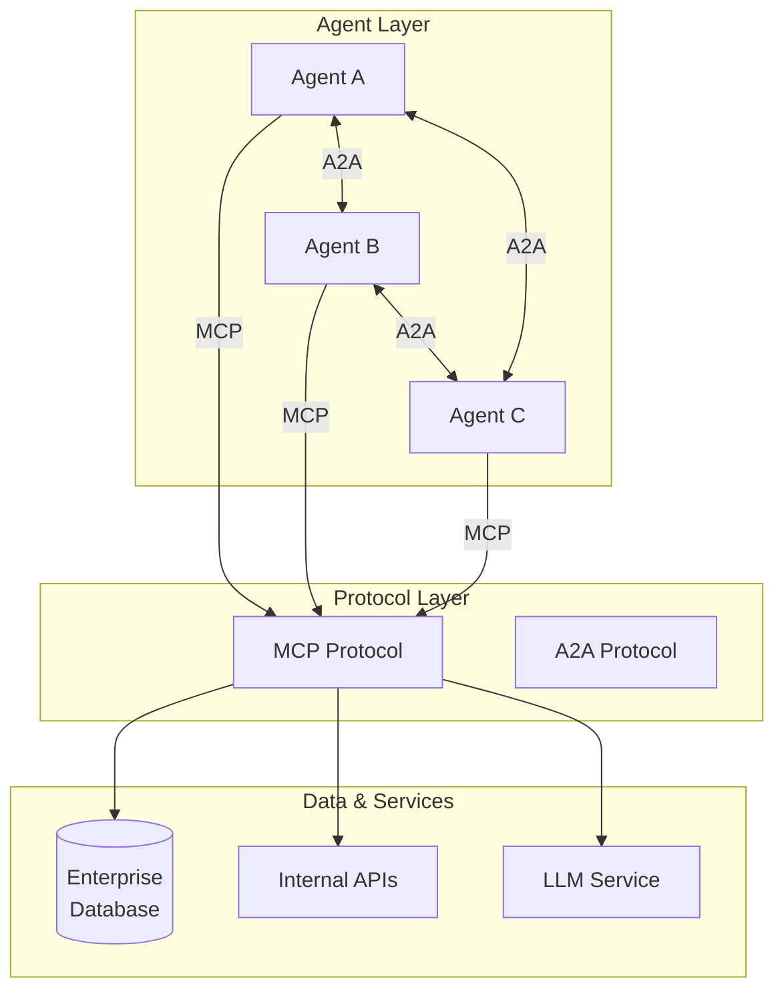

### 7.4 Development Lifecycle

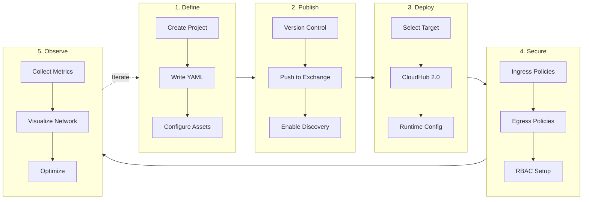

**Development Steps [[SRC-DOCS]](#src-docs):**

1. **Define:** Create Agent Network Project in ACB; configure YAML
2. **Publish:** Push to Exchange for discovery and reuse
3. **Deploy:** Deploy to CloudHub 2.0 via Runtime Manager
4. **Secure:** Apply Flex Gateway policies; configure RBAC
5. **Observe:** Monitor via Visualizer; optimize based on insights

---

## 8. Insight Tables

### 8.1 Feature Comparison Table

| Feature | Discover | Orchestrate | Govern | Observe |
|---------|----------|-------------|--------|---------|
| **Primary Component** | Agent Registry (Exchange) | Agent Broker | Flex Gateway | Agent Visualizer |
| **Key Function** | Catalog and find agents | Route and coordinate tasks | Enforce policies | Monitor and trace |
| **Configuration** | Asset publishing | YAML definitions | Policy attachment | Dashboard setup |
| **Base License Included** | Yes | No | No | No |
| **Infrastructure Required** | Exchange | Private Space, Flex Gateway | Flex Gateway | Anypoint Monitoring |

**Source:** [[SRC-INTRO](#src-intro), [SRC-DOCS](#src-docs)]

### 8.2 Policy Types Summary Table

| Policy Name | Target | Category | Function | Source |
|-------------|--------|----------|----------|--------|
| Client ID Enforcement | Agent & MCP Server | Authentication | Validates authorized consumers | [[SRC-GOVERN]](#src-govern) |
| A2A PII Detector | Agent | Compliance | Blocks/logs sensitive data in prompts | [[SRC-GOVERN]](#src-govern) |
| MCP Schema Validation | MCP Server | Traffic Control | Ensures protocol compliance | [[SRC-GOVERN]](#src-govern) |
| Prompt Decorator | Agent | Enhancement | Injects contextual information | [[SRC-INTRO]](#src-intro) |
| Agent Card Policy | Agent | Metadata | Rewrites Agent Card URL | [[SRC-INTRO]](#src-intro) |

### 8.3 Asset Types and Lifecycle States Table

| Asset Type | Description | Lifecycle States | Registration Method |
|------------|-------------|------------------|---------------------|
| A2A Agent | Agent-to-Agent capable autonomous agent | Stable, Development | A2A Card upload |
| MCP Server | Model Context Protocol server exposing tools | Stable, Development | MCP Schema upload |
| LLM | Large Language Model | Stable, Development | Provider selection |
| Agent Card | Published agent documentation | N/A | Exchange publication |
| API | Traditional API asset | Standard API lifecycle | RAML/OAS upload |

**Source:** [[SRC-DISCOVER](#src-discover), [SRC-DOCS](#src-docs)]

### 8.4 Infrastructure Requirements Matrix

| Component | Requirement | Notes | Source |
|-----------|-------------|-------|--------|
| Runtime | CloudHub 2.0 | Required for Broker deployment | [[SRC-ORCHESTRATE]](#src-orchestrate) |
| Gateway | Managed Flex Gateway | Both Ingress and Egress | [[SRC-GOVERN]](#src-govern) |
| Gateway Mode | Managed mode | Connected mode NOT supported | [[SRC-ORCHESTRATE]](#src-orchestrate) |
| IDE | Anypoint Code Builder | Extension Pack v1.11.5+ | [[SRC-DOCS]](#src-docs) |
| LLM | BYO-LLM | OpenAI/Azure at launch | [[SRC-GOVERN]](#src-govern) |
| Monitoring | Anypoint Monitoring | Titanium tier for advanced | [[SRC-OBSERVE]](#src-observe) |

### 8.5 LLM Support Matrix

| Provider | Current Support | Roadmap | Source |
|----------|-----------------|---------|--------|
| OpenAI (Direct API) | Supported | N/A | [[SRC-GOVERN]](#src-govern) |
| Azure OpenAI | Supported | N/A | [[SRC-GOVERN]](#src-govern) |
| Salesforce Einstein | Not Available | Coming | [[SRC-GOVERN]](#src-govern) |
| Google Vertex AI | Not Available | Coming | [[SRC-GOVERN]](#src-govern) |
| Amazon Bedrock | Not Available | Coming | [[SRC-GOVERN]](#src-govern) |
| Claude (Anthropic) | Not Available | Coming | [[SRC-DOCS]](#src-docs) |

---

## 9. Contrasts and Alignments

### 9.1 Convergence Points Across Sources

All six sources consistently agree on these fundamental concepts:

| Concept | Description | Sources |
|---------|-------------|---------|
| **Four Pillars** | Discover, Orchestrate, Govern, Observe | All sources |
| **Agent Sprawl Problem** | Fragmentation of AI agents across enterprise | [[SRC-DISCOVER](#src-discover), [SRC-OBSERVE](#src-observe), [SRC-INTRO](#src-intro)] |
| **Exchange as Registry** | Anypoint Exchange extended for agentic assets | [[SRC-DISCOVER](#src-discover), [SRC-DOCS](#src-docs)] |
| **Flex Gateway for Governance** | Primary policy enforcement point | [[SRC-GOVERN](#src-govern), [SRC-ORCHESTRATE](#src-orchestrate), [SRC-DOCS](#src-docs)] |
| **YAML-Based Configuration** | No drag-and-drop for agent networks | [[SRC-DISCOVER](#src-discover), [SRC-ORCHESTRATE](#src-orchestrate), [SRC-DOCS](#src-docs)] |
| **BYO-LLM Model** | OpenAI/Azure OpenAI at launch | [[SRC-GOVERN](#src-govern), [SRC-ORCHESTRATE](#src-orchestrate)] |

### 9.2 Terminology Variations and Standardization

| Concept | Variations Found | Standardized Term | Primary Source |
|---------|------------------|-------------------|----------------|
| Agent documentation | "Agent Cart", "Agent Card" | **Agent Card** | [[SRC-DOCS]](#src-docs) |
| Registry | "Agent Registry", "Enterprise Agent Registry" | **Agent Registry** | [[SRC-DISCOVER]](#src-discover) |
| Mule AI IDE | "MuleSoft Vibes", "MuleSoft AI Developer Agent" | Context-dependent | [[SRC-DISCOVER](#src-discover), [SRC-INTRO](#src-intro)] |
| Orchestration pattern | "Agentic Loop", "Multi-agent workflow" | **Agent Network** | [[SRC-DOCS]](#src-docs) |
| Gateway policies | "A2A policies", "MCP policies", "Agent policies" | **Agent Policies** | [[SRC-GOVERN]](#src-govern) |

### 9.3 Feature Depth by Source

| Source | Strongest Coverage | Limited Coverage |
|--------|-------------------|------------------|
| [[SRC-DISCOVER]](#src-discover) | Agent Registry, Asset Types, Publishing | Orchestration, Observability |
| [[SRC-GOVERN]](#src-govern) | Flex Gateway, Policies, PII Detection | Discovery workflow |
| [[SRC-OBSERVE]](#src-observe) | Visualizer, Traces, Monitoring | Orchestration mechanics |
| [[SRC-ORCHESTRATE]](#src-orchestrate) | Agent Broker, A2A/MCP, YAML Config | Observability details |
| [[SRC-INTRO]](#src-intro) | End-to-end demo, Business context | Technical depth |
| [[SRC-DOCS]](#src-docs) | Comprehensive architecture, Diagrams | Demo narratives |

### 9.4 Roadmap Items vs Current Capabilities

| Feature | Current State | Roadmap | Source |
|---------|---------------|---------|--------|
| LLM Support | OpenAI, Azure OpenAI | Einstein, Bedrock, Vertex, Claude | [[SRC-GOVERN]](#src-govern) |
| Registry Sync | Manual registration | Automated aggregation | [[SRC-DISCOVER]](#src-discover) |
| MCP Visualization | Server-level only | Tool-level granularity | [[SRC-OBSERVE]](#src-observe) |
| Custom A2A/MCP Policies | Unconfirmed | Under evaluation | [[SRC-GOVERN]](#src-govern) |
| Drag-and-Drop | Not available | No indication on roadmap | [[SRC-DISCOVER]](#src-discover) |
| LLM Cataloging | Not in registry | Coming to Exchange | [[SRC-GOVERN]](#src-govern) |

---

## 10. Final Takeaways

### 10.1 Strategic Recommendations

1. **Centralize Discovery Immediately**
   - Begin cataloging existing "shadow" agents in Anypoint Exchange [[SRC-DISCOVER]](#src-discover)
   - Register Python scripts, LangChain workflows, and external agents
   - Establish registration protocols requiring all new assets to be published [[SRC-DISCOVER]](#src-discover)

2. **Adopt the Dual-Protocol Pattern**
   - Use **A2A** for agent delegation requiring reasoning
   - Use **MCP** for deterministic tool execution
   - Prevent hallucination by forcing math/logic to MCP tools [[SRC-ORCHESTRATE]](#src-orchestrate)

3. **Implement Dual-Layer Governance**
   - Apply policies at both Agent and MCP Server layers
   - Configure both Ingress and Egress gateways
   - Use Client ID Enforcement at every boundary [[SRC-GOVERN]](#src-govern)

4. **Mandate Observability from Day One**
   - Do not deploy agents without monitoring enabled
   - Use Traces for compliance auditing in regulated industries
   - Integrate troubleshooting workflow: Insights → Traces → Logs [[SRC-OBSERVE]](#src-observe)

### 10.2 Implementation Priorities

| Priority | Action | Timeline | Dependency |
|----------|--------|----------|------------|
| **P0** | Audit existing agents across organization | Immediate | None |
| **P1** | Register agents in Anypoint Exchange | Week 1-2 | Audit complete |
| **P2** | Provision Private Space + Managed Flex Gateway | Week 2-3 | Platform access |
| **P3** | Define first Agent Network in YAML | Week 3-4 | Infrastructure ready |
| **P4** | Apply governance policies | Week 4-5 | Deployment complete |
| **P5** | Configure Agent Visualizer | Week 5-6 | Monitoring enabled |

### 10.3 Common Pitfalls to Avoid

| Pitfall | Description | Mitigation | Source |
|---------|-------------|------------|--------|
| **Context Rot** | Exposing System APIs directly as MCP tools overloads LLM | Wrap in Process/Experience APIs | [[SRC-INTRO]](#src-intro) |
| **LLM Math** | Allowing LLM to perform calculations | Force to Calculator MCP | [[SRC-ORCHESTRATE]](#src-orchestrate) |
| **Single-Layer Security** | Only applying policies to Broker | Secure both Agent and MCP layers | [[SRC-GOVERN]](#src-govern) |
| **Ignoring Egress** | Only governing inbound traffic | Configure Egress gateway for outbound | [[SRC-ORCHESTRATE]](#src-orchestrate) |
| **Unmonitored Deployment** | Deploying agents without observability | Enable Visualizer before production | [[SRC-OBSERVE]](#src-observe) |
| **Transformation in Broker** | Putting DataWeave in Broker YAML | Handle transforms in underlying API | [[SRC-INTRO]](#src-intro) |
| **Node Overload** | Exceeding ~25 nodes per network | Use broker-of-brokers pattern | [[SRC-ORCHESTRATE]](#src-orchestrate) |

---

## 11. Appendix A - For Architects

### A.1 Protocol Specifications

#### A2A (Agent-to-Agent) Protocol [[SRC-ORCHESTRATE](#src-orchestrate)]

```
Protocol Type: Peer-to-Peer Communication (Open Standard - Linux Foundation)
Transport: JSON-RPC 2.0 over HTTP(S)
Discovery: Agent Cards at /.well-known/agent-card.json (RFC 8615)
Communication: Sync, Streaming (SSE), Async Push Notifications
Use Case: Delegation to agents with reasoning capabilities

Request Flow:
1. Broker sends JSON RPC request to agent endpoint
2. Agent processes with its LLM
3. Agent returns reasoned response
4. Broker synthesizes into final output

Agent Card Structure (per a2a-protocol.org specification):
> **Required fields (A2A Agent Card):** `name`, `url`, `version`  
> **Nota (rioplatense):** el `url` requerido es el endpoint del servicio (p.ej. `/a2a`). Si falta, Exchange rechaza el asset con errores del estilo `required key [url] not found`.
{
  "name": "Badging Agent",
  "description": "Handles employee badge requests",
  "provider": { "organization": "ACME Corp" },
  "url": "https://agent.example.com/a2a",
  "version": "1.0.0",
  "capabilities": {
    "streaming": true,
    "pushNotifications": false
  },
  "authentication": {
    "schemes": ["Bearer"]
  },
  "skills": [
    {
      "id": "create_badge",
      "name": "Create Badge",
      "description": "Creates a new employee badge",
      "inputModes": ["text"],
      "outputModes": ["text", "file"],
      "examples": ["Create a badge for John Smith"]
    }
  ]
}
```

#### MCP (Model Context Protocol) [[SRC-ORCHESTRATE](#src-orchestrate)], [[SRC-MCP-OFFICIAL]](#src-mcp-official)

MCP is an **open-source standard** for connecting AI applications to external systems. Developed by Anthropic and available at [modelcontextprotocol.io](https://modelcontextprotocol.io/).

> *"Think of MCP like a USB-C port for AI applications. Just as USB-C provides a standardized way to connect electronic devices, MCP provides a standardized way to connect AI applications to external systems."* — [MCP Official Docs](https://modelcontextprotocol.io/)

```
Protocol Type: Open Standard for AI-to-External-System Connection
Origin: Anthropic (Open Source)
Transport: HTTP/JSON (Streamable HTTP, SSE supported)
Communication: Input/Output (Function Call)
Use Case: Connect AI apps to data sources, tools, and workflows

Components:
- Data Sources: Local files, databases, APIs
- Tools: Search engines, calculators, specialized functions
- Workflows: Specialized prompts, orchestrations

Request Flow:
1. Broker identifies need for specific tool
2. Broker sends structured request to MCP server
3. MCP server executes deterministic logic
4. Server returns exact result

MCP Schema Structure:
{
  "tools": [
    {
      "name": "calculate",
      "description": "Performs arithmetic operations",
      "parameters": {
        "operation": "string",
        "operands": "array<number>"
      }
    }
  ]
}
```

**MCP Ecosystem Benefits:**
- **Developers:** Reduces development time and complexity for AI integrations
- **AI Applications:** Provides access to ecosystem of data sources, tools, and apps
- **End-users:** Results in more capable AI applications that access data and take actions

#### Complementary Protocols and Frameworks [[SRC-A2A-OFFICIAL](#src-a2a-official)]

The A2A ecosystem includes several complementary protocols and frameworks:

| Protocol/Framework | Relationship | Description |
|--------------------|--------------|-------------|
| **IBM ACP** | Incorporated into A2A | IBM's Agent Communication Protocol has been merged into the A2A specification |
| **Cisco agntcy** | Leverages A2A + MCP | Framework providing "Internet of Agents" components with discovery, group communication, identity, and observability |
| **Google ADK** | Build with A2A | Agent Development Kit for building A2A-compliant agents |

#### Official A2A SDKs [[SRC-A2A-OFFICIAL](#src-a2a-official)]

The A2A Protocol provides official SDKs in multiple languages:

| Language | Installation | Repository |
|----------|--------------|------------|
| **Python** | `pip install a2a-sdk` | [a2a-python](https://github.com/a2aproject/a2a-python) |
| **Go** | `go get github.com/a2aproject/a2a-go` | [a2a-go](https://github.com/a2aproject/a2a-go) |
| **JavaScript** | `npm install @a2a-js/sdk` | [a2a-js](https://github.com/a2aproject/a2a-js) |
| **Java** | Maven dependency | [a2a-java](https://github.com/a2aproject/a2a-java) |
| **C#/.NET** | NuGet package | [a2a-dotnet](https://github.com/a2aproject/a2a-dotnet) |

### A.2 Integration Patterns

#### Pattern 1: API Layering for Agents [[SRC-INTRO](#src-intro)]

**Problem:** Exposing System APIs directly as MCP tools causes "context rot"—overloading the LLM with irrelevant information.

**Solution:**
```
System APIs → Process APIs → Experience APIs → MCP Server

Example:
- System: /customers/{id}, /orders/{id}, /inventory/{sku}
- Process: /customer-order-history/{id}
- Experience: /customer-360/{id}
- MCP Tool: get_customer_profile
```

#### Pattern 2: Broker-of-Brokers [[SRC-ORCHESTRATE](#src-orchestrate)]

**Problem:** Single broker exceeds ~25 node complexity limit.

**Solution:**
```
Master Broker
├── HR Broker
│   ├── Workday Agent
│   ├── Benefits Agent
│   └── Onboarding MCP
├── IT Broker
│   ├── Zendesk Agent
│   ├── Badge Agent
│   └── Provisioning MCP
└── Sales Broker
    ├── Salesforce Agent
    └── Territory MCP
```

#### Pattern 3: Separation of Concerns [[SRC-INTRO](#src-intro)]

| Concern | Handled By | NOT Handled By |
|---------|------------|----------------|
| Data Transformation | API Implementation, MCP Tool | Broker YAML |
| Error Handling | Individual Agents/Tools | Broker centrally |
| Business Logic | Underlying Services | Broker YAML |
| Routing Logic | Broker YAML, LLM Reasoning | Agents |

### A.3 Security Architecture

#### Zero Trust Implementation [[SRC-DOCS]](#src-docs)

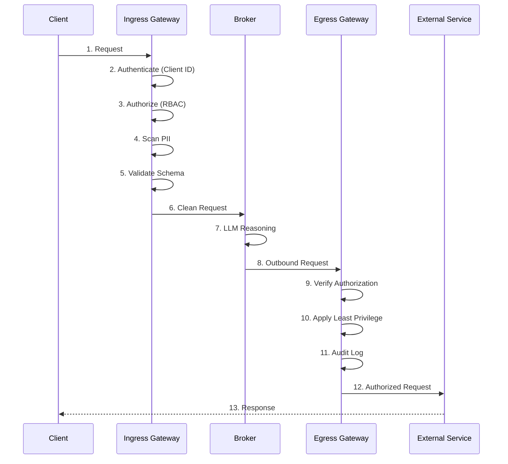

#### RBAC Propagation [[SRC-DOCS]](#src-docs)

- Centralized credentials management
- Audit trails for all interactions
- Policy inheritance across the network
- Separation of duties enforcement

### A.4 Performance Considerations

| Consideration | Recommendation | Source |
|---------------|----------------|--------|
| **Node Count** | Limit to ~25 nodes per network | [[SRC-ORCHESTRATE]](#src-orchestrate) |
| **LLM Selection** | Choose based on latency vs capability | [[SRC-GOVERN]](#src-govern) |
| **Tool Granularity** | More specific tools = faster routing | [[SRC-ORCHESTRATE]](#src-orchestrate) |
| **Context Size** | Minimize context via API layering | [[SRC-INTRO]](#src-intro) |
| **Caching** | Cache Agent Cards for discovery | [[SRC-ORCHESTRATE]](#src-orchestrate) |
| **Timeout Config** | Configure appropriate timeouts per tool | [[SRC-OBSERVE]](#src-observe) |

### A.5 Infrastructure Checklist

#### Pre-Deployment Checklist

- [ ] CloudHub 2.0 Private Space provisioned
- [ ] Managed Flex Gateway configured (NOT connected mode)
- [ ] Ingress Gateway configured
- [ ] Egress Gateway configured
- [ ] API Manager access confirmed
- [ ] LLM API credentials configured (OpenAI/Azure)
- [ ] Anypoint Code Builder installed (Extension Pack v1.11.5+)
- [ ] Exchange permissions for publishing
- [ ] Anypoint Monitoring enabled (Titanium recommended)

#### Post-Deployment Checklist

- [ ] All agents registered in Exchange
- [ ] Client ID Enforcement applied to Broker
- [ ] Client ID Enforcement applied to MCP Servers
- [ ] PII Detection enabled on Agent layer
- [ ] Schema Validation enabled on MCP layer
- [ ] Agent Visualizer configured
- [ ] Trace collection enabled
- [ ] Alert thresholds configured

---

## 12. Appendix B - For Presales Personnel

### B.1 Business Value Propositions by Pillar

| Pillar | Business Value | Key Message |
|--------|----------------|-------------|
| **Discover** | Prevent duplicate development, accelerate innovation | "Find and reuse existing AI investments across your enterprise" |
| **Orchestrate** | Enable complex cross-domain automation | "Connect siloed agents to execute end-to-end business processes" |
| **Govern** | Reduce compliance risk, ensure responsible AI | "Enterprise-grade guardrails for every agent interaction" |
| **Observe** | Optimize performance, enable audit trails | "Transform the AI black box into transparent, accountable systems" |

### B.2 Use Case Library

#### Use Case 1: Employee Onboarding [[SRC-INTRO](#src-intro)]

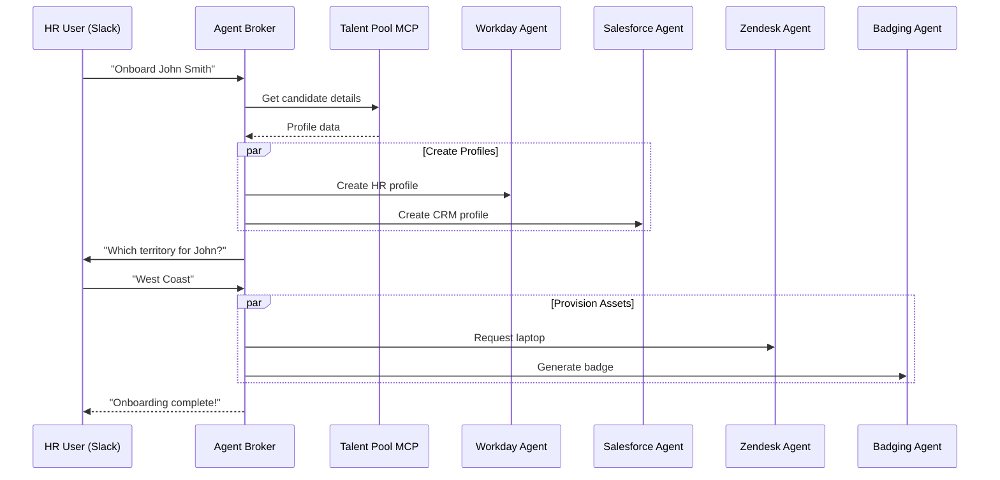

**Business Impact:**
- Reduces onboarding time from days to hours
- Eliminates manual handoffs between HR, IT, and Facilities
- Ensures consistent experience across all new hires
- Audit trail for compliance

#### Use Case 2: Mortgage Application Processing [[SRC-DOCS]](#src-docs)

**Scenario:** Customer initiates mortgage application through banking platform.

**Flow:**
1. User interacts with "Mortgage Assistant" agent
2. Agent Broker decomposes the task
3. Credit Check Agent performs real-time validation
4. DocuSign Agent handles signatures
5. Compliance Agent enforces regulations
6. Every interaction governed by Flex Gateway

**Business Impact:**
- Accelerates loan processing
- Ensures regulatory compliance
- Reduces manual review workload
- Improves customer experience

#### Use Case 3: Supply Chain Management [[SRC-DOCS]](#src-docs)

**Scenario:** Shipment delay detected in logistics network.

**Flow:**
1. Operations Agent receives delay notification
2. Broker coordinates with Fleet Agent for re-routing
3. SAP Agent updates inventory in real-time
4. Quality Control Agent flags warehouse issues
5. Visualizer enables IT to monitor and optimize

**Business Impact:**
- Proactive issue resolution
- Real-time inventory accuracy
- Reduced delivery delays
- End-to-end visibility

### B.3 ROI Indicators

| Metric | Typical Impact | Measurement |
|--------|----------------|-------------|
| **Development Time** | 40-60% reduction | Time to deploy new agent workflows |
| **Duplication Waste** | 30% recovery | Reused agents vs new builds |
| **Compliance Risk** | 70% reduction | Policy violations blocked |
| **MTTR** | 50% improvement | Mean Time to Resolution for agent issues |
| **Onboarding Time** | 80% reduction | Time to productive new hire |

### B.4 Competitive Positioning

| Differentiator | MuleSoft Agent Fabric | Alternative Approaches |
|----------------|----------------------|------------------------|
| **Registry** | Unified catalog (Exchange) for APIs + Agents | Separate tools, fragmented |
| **Protocols** | Open standards (MCP, A2A) | Proprietary protocols |
| **Governance** | Existing Flex Gateway extended | New security layer required |
| **Observability** | Integrated Visualizer | Third-party monitoring |
| **Development** | Familiar platform (ACB) | New tooling to learn |
| **Ecosystem** | 1000+ existing connectors | Start from scratch |

**Key Messages:**
- "Leverage your existing MuleSoft investment"
- "Open standards prevent vendor lock-in"
- "Unified platform for APIs and Agents"
- "Enterprise-grade from day one"

### B.5 Customer-Facing Messaging Templates

#### Executive Pitch (30 seconds)

> "Your enterprise likely has dozens of AI agents—in Salesforce, Workday, custom builds—all operating in silos. MuleSoft Agent Fabric transforms these disconnected agents into a governed, intelligent network. You get a central registry to find and reuse agents, intelligent orchestration to coordinate cross-domain processes, enterprise-grade governance for compliance, and full observability into every AI decision."

#### Discovery Qualification Questions

1. "How many AI agents are currently deployed across your organization?"
2. "Do you have visibility into how your agents make decisions?"
3. "Have you experienced compliance concerns with AI-driven processes?"
4. "Are different teams building similar agent capabilities?"
5. "Can your agents today coordinate across Salesforce, Workday, and custom systems?"

#### Objection Handling

| Objection | Response |
|-----------|----------|
| "We're already using [competitor]" | "Agent Fabric is protocol-agnostic. We can orchestrate agents from any platform, including [competitor], through our open A2A protocol." |
| "We built our own orchestration" | "Custom orchestration often lacks governance and observability. Agent Fabric adds enterprise-grade security and compliance without replacing what you've built." |
| "Our agents work fine today" | "Individual agents may work well, but can they coordinate across systems? Agent Fabric enables end-to-end automation that isolated agents cannot achieve." |
| "It's too early for agent governance" | "Early governance is easier than retrofitting. Start with Discovery—it's included in your base subscription—and add governance as you scale." |

---

## 13. Reference Materials

### 13.1 Bibliography

#### MuleSoft Agent Fabric Sources

| Source ID | Title | URL | Type |
|-----------|-------|-----|------|
| <span id="src-discover">**[SRC-DISCOVER]**</span> | Between the Seams: Discover Agents with MuleSoft Agent Fabric | https://www.youtube.com/watch?v=5RhUac1SsSI | Video/Transcript |
| <span id="src-govern">**[SRC-GOVERN]**</span> | Between the Seams: Govern Agents with MuleSoft Agent Fabric | https://www.youtube.com/watch?v=_WJDfgYVvYk | Video/Transcript |
| <span id="src-observe">**[SRC-OBSERVE]**</span> | Between the Seams: Observe Agents with MuleSoft Agent Fabric | https://www.youtube.com/watch?v=R_R_WsIe1i0 | Video/Transcript |
| <span id="src-orchestrate">**[SRC-ORCHESTRATE]**</span> | Between the Seams: Orchestrate Agents with MuleSoft Agent Fabric | https://www.youtube.com/watch?v=Nc7Uv26tmoM | Video/Transcript |
| <span id="src-intro">**[SRC-INTRO]**</span> | Introducing MuleSoft Agent Fabric | https://www.youtube.com/watch?v=W6R-x7-wP6A | Video/Transcript |
| <span id="src-docs">**[SRC-DOCS]**</span> | MuleSoft Agent Fabric Documentation | https://docs.mulesoft.com/agent-fabric/ | Official Docs |
| **[SRC-DOCS]** | Agent Fabric Release Notes | https://docs.mulesoft.com/agent-fabric/agent-fabric-release-notes | Official Docs |
| **[SRC-DOCS]** | Agent Fabric Learning Map | https://docs.mulesoft.com/agent-fabric/learning-map-agent-fabric | Official Docs |
| **[SRC-DOCS]** | MuleSoft Agent Fabric Announcement | https://www.salesforce.com/news/stories/mulesoft-agent-fabric-announcement/ | Press Release |
| **[SRC-DOCS]** | Agent Visualizer Documentation | https://docs.mulesoft.com/agent-visualizer/ | Official Docs |

#### A2A Protocol Official Sources (Verified December 2025)

| Source ID | Title | URL | Type |
|-----------|-------|-----|------|
| <span id="src-a2a-official">**[SRC-A2A-OFFICIAL]**</span> | A2A Protocol Official Documentation | https://a2a-protocol.org/latest/ | Official Docs |
| **[SRC-A2A-OFFICIAL]** | A2A Protocol Specification | https://a2a-protocol.org/latest/specification/ | Technical Spec |
| **[SRC-A2A-OFFICIAL]** | A2A Agent Discovery | https://a2a-protocol.org/latest/topics/agent-discovery/ | Official Docs |
| **[SRC-A2A-OFFICIAL]** | A2A Enterprise Features | https://a2a-protocol.org/latest/topics/enterprise-ready/ | Official Docs |
| **[SRC-A2A-OFFICIAL]** | A2A Key Concepts | https://a2a-protocol.org/latest/topics/key-concepts/ | Official Docs |
| **[SRC-A2A-OFFICIAL]** | A2A and MCP Relationship | https://a2a-protocol.org/latest/topics/a2a-and-mcp/ | Official Docs |
| **[SRC-A2A-OFFICIAL]** | A2A GitHub Repository | https://github.com/a2aproject/A2A | Source Code |

#### MuleSoft A2A Connector Sources (Verified December 2025)

| Source ID | Title | URL | Type |
|-----------|-------|-----|------|
| <span id="src-mulesoft-a2a">**[SRC-MULESOFT-A2A]**</span> | A2A Connector Documentation | https://docs.mulesoft.com/a2a-connector/latest/ | Official Docs |
| **[SRC-MULESOFT-A2A]** | A2A Connector - Anypoint Exchange | https://www.mulesoft.com/exchange/com.mulesoft.connectors/mule4-a2a-connector/ | Exchange |

#### MuleSoft MCP Connector Sources (Verified December 2025)

| Source ID | Title | URL | Type |
|-----------|-------|-----|------|
| <span id="src-mulesoft-mcp">**[SRC-MULESOFT-MCP]**</span> | MCP Connector Documentation | https://docs.mulesoft.com/mcp-connector/latest/ | Official Docs |

> **MuleSoft MCP Connector:** Version 1.3 (for Mule 4.9.6+). Enables MCP server and client capabilities in Mule applications. Supports Streamable HTTP (recommended) and SSE transport methods. Provides distributed tracing support.

#### MCP Protocol Official Sources (Verified December 2025)

| Source ID | Title | URL | Type |
|-----------|-------|-----|------|
| <span id="src-mcp-official">**[SRC-MCP-OFFICIAL]**</span> | Model Context Protocol Official Site | https://modelcontextprotocol.io/ | Official Docs |
| **[SRC-MCP-OFFICIAL]** | MCP Specification | https://modelcontextprotocol.io/specification | Technical Spec |
| **[SRC-MCP-OFFICIAL]** | MCP GitHub Repository | https://github.com/modelcontextprotocol | Source Code |

> **Note:** MCP (Model Context Protocol) is an open-source standard developed by Anthropic. It provides a standardized way to connect AI applications to external data sources, tools, and workflows.

> **Note:** The A2A Protocol was originally developed by Google and is now donated to the Linux Foundation as an open-source project (Apache License 2.0). Current version: v0.3.0 (July 2025). The protocol has 21k+ stars on GitHub and 131+ contributors.
>
> **MuleSoft A2A Connector:** Version 0.4.0-BETA (for Mule 4). This is a beta release providing support for the Agent2Agent protocol in MuleSoft applications.

### 13.2 Source Cross-Reference Table

| Topic | [[SRC-DISCOVER]](#src-discover) | [[SRC-GOVERN]](#src-govern) | [[SRC-OBSERVE]](#src-observe) | [[SRC-ORCHESTRATE]](#src-orchestrate) | [[SRC-INTRO]](#src-intro) | [[SRC-DOCS]](#src-docs) |
|-------|----------------|--------------|---------------|-------------------|-------------|------------|
| Four Pillars Overview | ✓ | ✓ | ✓ | ✓ | ✓ | ✓ |
| Agent Registry | ✓✓✓ | ✓ | ✓ | ✓ | ✓ | ✓✓ |
| Asset Types | ✓✓✓ | ✓ | | | ✓ | ✓✓ |
| Agent Broker | ✓ | ✓ | ✓ | ✓✓✓ | ✓✓ | ✓✓ |
| A2A Protocol | ✓ | | | ✓✓✓ | | ✓✓ |
| MCP Protocol | ✓ | ✓ | | ✓✓✓ | ✓ | ✓✓ |
| Flex Gateway | | ✓✓✓ | | ✓✓ | ✓ | ✓✓ |
| Policy Types | | ✓✓✓ | | ✓ | ✓ | ✓ |
| Agent Visualizer | | | ✓✓✓ | | ✓ | ✓✓ |
| Performance Monitoring | | | ✓✓✓ | | | ✓ |
| Tracing | | | ✓✓✓ | | | ✓ |
| Employee Onboarding Demo | | ✓ | | | ✓✓✓ | ✓ |
| YAML Configuration | ✓ | | | ✓✓ | ✓ | ✓✓ |
| LLM Support | | ✓✓ | | ✓ | | ✓ |
| Infrastructure Requirements | ✓ | ✓ | | ✓✓ | ✓ | ✓✓ |

Legend: ✓ = Mentioned, ✓✓ = Moderate coverage, ✓✓✓ = Deep coverage

### 13.3 Glossary with Source Attribution

| Term | Definition | Source |
|------|------------|--------|
| **A2A (Agent-to-Agent)** | An open protocol (originally by Google, now Linux Foundation) using JSON-RPC 2.0 over HTTP(S) for peer-to-peer communication between opaque AI agents. Supports sync, streaming (SSE), and async push notifications. Discovery via Agent Cards at `/.well-known/agent-card.json` | [[SRC-A2A-OFFICIAL]](#src-a2a-official) |
| **A2A Connector (MuleSoft)** | MuleSoft connector for implementing A2A protocol in Mule 4 applications. Current version: 0.4.0-BETA | [[SRC-MULESOFT-A2A]](#src-mulesoft-a2a) |
| **MCP Connector (MuleSoft)** | MuleSoft connector enabling MCP server/client capabilities in Mule 4.9.6+ apps. Current version: 1.3. Supports Streamable HTTP and SSE transport | [[SRC-MULESOFT-MCP]](#src-mulesoft-mcp) |
| **A2A SDK** | Official Software Development Kits for implementing A2A protocol in Python, Go, JavaScript, Java, and C#/.NET | [[SRC-A2A-OFFICIAL]](#src-a2a-official) |
| **Agent Broker** | An intelligent routing service that uses LLM to coordinate task delegation across agents and tools | [[SRC-ORCHESTRATE](#src-orchestrate), [SRC-DOCS](#src-docs)] |
| **Agent Card** | A JSON document serving as a digital "business card" for an A2A Server, containing identity, service endpoint, capabilities, authentication, and skills. Hosted at `/.well-known/agent-card.json` per RFC 8615 | [[SRC-A2A-OFFICIAL](#src-a2a-official), [SRC-GOVERN](#src-govern)] |
| **AgentSkill** | Component of an Agent Card describing a specific capability with id, name, description, inputModes, outputModes, and examples | [[SRC-A2A-OFFICIAL]](#src-a2a-official) |
| **Agent Fabric** | MuleSoft solution to discover, orchestrate, govern, and observe AI agents across an enterprise | All sources |
| **Agent Network** | A coordinated group of brokers, agents, and MCP servers defined by a YAML template | [[SRC-DOCS]](#src-docs) |
| **Agent Registry** | Extension of Anypoint Exchange serving as a single source of truth for agentic assets | [[SRC-DISCOVER]](#src-discover) |
| **Agent Sprawl** | The proliferation of disconnected AI agents across teams and vendors | [[SRC-INTRO](#src-intro), [SRC-DOCS](#src-docs)] |
| **Agent Visualizer** | Tool providing visual maps of agent networks, showing relationships and governance gaps | [[SRC-OBSERVE](#src-observe), [SRC-DOCS](#src-docs)] |
| **Agentic Assets** | Collective term for agents, brokers, and MCP servers managed in Agent Fabric | [[SRC-DOCS]](#src-docs) |
| **Agentic Loop** | An orchestration pattern where an agent iteratively reasons and executes tasks | [[SRC-GOVERN]](#src-govern) |
| **Anypoint Code Builder (ACB)** | IDE for creating Agent Network Projects using YAML definitions | [[SRC-DISCOVER](#src-discover), [SRC-DOCS](#src-docs)] |
| **Anypoint Exchange** | Repository serving as the backend for Agent Registry | [[SRC-DISCOVER]](#src-discover) |
| **Anypoint Insights** | Dashboard for high-level performance metrics (traffic, errors, latency) | [[SRC-OBSERVE]](#src-observe) |
| **Cisco agntcy** | A framework providing "Internet of Agents" components with discovery, group communication, identity, and observability; leverages A2A and MCP | [[SRC-A2A-OFFICIAL]](#src-a2a-official) |
| **CloudHub 2.0** | Runtime environment for deploying Agent Broker and related components | [[SRC-GOVERN](#src-govern), [SRC-ORCHESTRATE](#src-orchestrate)] |
| **Context Rot** | Degradation of LLM performance due to overloading with irrelevant information | [[SRC-INTRO]](#src-intro) |
| **Deterministic** | Processes with pre-coded, predictable paths (typical of APIs) | [[SRC-DISCOVER]](#src-discover) |
| **Flex Gateway** | API gateway enforcing policies on agents and MCP servers | [[SRC-GOVERN](#src-govern), [SRC-DOCS](#src-docs)] |
| **Google ADK** | Google's Agent Development Kit for building A2A-compliant agents | [[SRC-A2A-OFFICIAL]](#src-a2a-official) |
| **Human-in-the-Loop (HITL)** | Pattern where automated agent pauses for human input or approval | [[SRC-INTRO](#src-intro), [SRC-DOCS](#src-docs)] |
| **IBM ACP** | IBM's Agent Communication Protocol, now incorporated into the A2A Protocol specification | [[SRC-A2A-OFFICIAL]](#src-a2a-official) |
| **Lifecycle State** | Metadata tag (Stable, Development) applied to assets in registry | [[SRC-DISCOVER]](#src-discover) |
| **Linux Foundation** | Open-source foundation that now hosts the A2A Protocol (originally developed by Google) | [[SRC-A2A-OFFICIAL]](#src-a2a-official) |
| **Managed Flex Gateway** | Gateway mode required for Agent Broker deployment | [[SRC-ORCHESTRATE]](#src-orchestrate) |
| **MCP (Model Context Protocol)** | Open-source standard (by Anthropic) for connecting AI applications to external data sources, tools, and workflows. "USB-C port for AI applications" | [[SRC-MCP-OFFICIAL](#src-mcp-official), [SRC-ORCHESTRATE](#src-orchestrate)] |
| **MCP Server** | Server implementing MCP to expose specific tools to agents | [[SRC-DISCOVER](#src-discover), [SRC-GOVERN](#src-govern)] |
| **MuleChain Connectors** | Connectors for building agentic workflows and connecting to LLMs | [[SRC-GOVERN]](#src-govern) |
| **MuleSoft Vibes** | AI capability in ACB enabling natural language asset discovery | [[SRC-DISCOVER]](#src-discover) |
| **Non-Deterministic** | Processes where path is reasoned dynamically by LLM | [[SRC-DISCOVER](#src-discover), [SRC-OBSERVE](#src-observe)] |
| **Private Space** | CloudHub 2.0 environment required for Broker deployment | [[SRC-ORCHESTRATE]](#src-orchestrate) |
| **RBAC** | Role-Based Access Control enforced across agent interactions | [[SRC-DOCS]](#src-docs) |
| **Traces** | Detailed view of request flow for end-to-end troubleshooting | [[SRC-OBSERVE]](#src-observe) |

---

*Document generated based on MuleSoft Agent Fabric source materials. Last updated: December 2025.*

*All claims in this compendium are attributed to their source materials using the [SRC-ID] citation format. For official and current information, refer to the MuleSoft documentation at https://docs.mulesoft.com/agent-fabric/.*

---

### Document Verification Notes

**A2A Protocol Verification (December 13, 2025)**

This document has been verified against the official A2A Protocol documentation at [a2a-protocol.org](https://a2a-protocol.org/latest/) and the official GitHub repository at [github.com/a2aproject/A2A](https://github.com/a2aproject/A2A).

**Key Corrections Applied:**

| Correction | Previous Value | Corrected Value | Source |
|------------|----------------|-----------------|--------|
| Agent Card Discovery URL | `/.well-known/agent-card` | `/.well-known/agent-card.json` | [A2A Agent Discovery](https://a2a-protocol.org/latest/topics/agent-discovery/) |
| Protocol Origin | Not specified | Google → Linux Foundation | [A2A Official Docs](https://a2a-protocol.org/latest/) |
| Interaction Modes | "Prompt/Response" only | Sync, Streaming (SSE), Async Push | [A2A Specification](https://a2a-protocol.org/latest/specification/) |
| Agent Card Structure | Basic fields | Full structure with Skills, Authentication, Capabilities | [A2A Agent Discovery](https://a2a-protocol.org/latest/topics/agent-discovery/) |
| Related Protocols | Not mentioned | IBM ACP (incorporated), Cisco agntcy | [A2A Official Docs](https://a2a-protocol.org/latest/) |
| Official SDKs | Not mentioned | Python, Go, JS, Java, .NET | [A2A GitHub](https://github.com/a2aproject/A2A) |

**A2A Protocol Version:** v0.3.0 (July 2025)
**GitHub Stats:** 21k+ stars, 131+ contributors

---

**MuleSoft A2A Connector Verification (December 13, 2025)**

| Property | Value | Source |
|----------|-------|--------|
| **Connector Name** | A2A Connector | [MuleSoft Docs](https://docs.mulesoft.com/a2a-connector/latest/) |
| **Current Version** | 0.4.0-BETA | [MuleSoft Docs](https://docs.mulesoft.com/a2a-connector/latest/) |
| **Mule Version** | Mule 4 | [Anypoint Exchange](https://www.mulesoft.com/exchange/com.mulesoft.connectors/mule4-a2a-connector/) |
| **Status** | Beta | [MuleSoft Docs](https://docs.mulesoft.com/a2a-connector/latest/) |

**Note:** The connector is in BETA status. Features and API may change before general availability.

---

**Document Version History:**

| Version | Date | Changes |
|---------|------|---------|
| 1.0 | December 2025 | Initial document based on MuleSoft Agent Fabric sources |
| 1.1 | December 13, 2025 | Verified against A2A Protocol official docs; Added MuleSoft A2A Connector version (0.4.0-BETA); Updated Agent Card discovery URL; Added IBM ACP, Cisco agntcy, Google ADK references; Added official A2A SDKs |
| 1.1 | December 14, 2025 | Added MuleSoft MCP Connector version (1.3) with transport methods (Streamable HTTP, SSE); Added MCP client/server capabilities |
